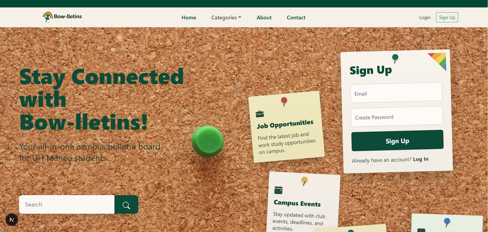
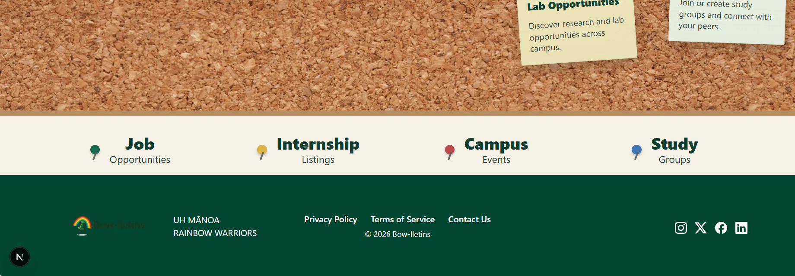
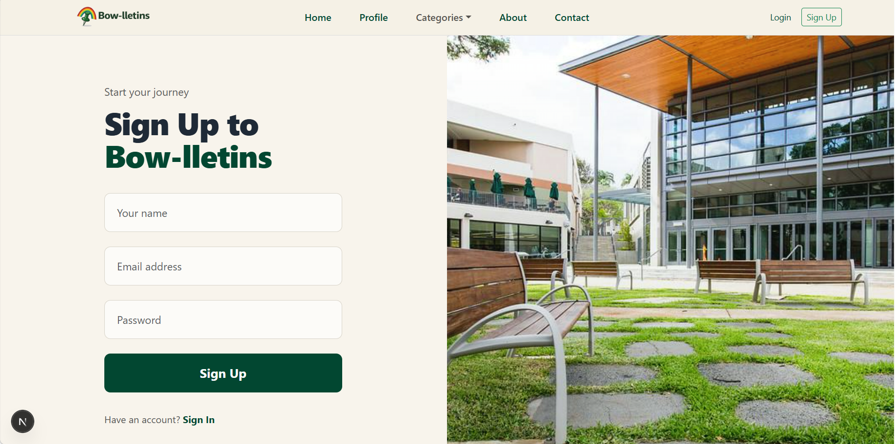
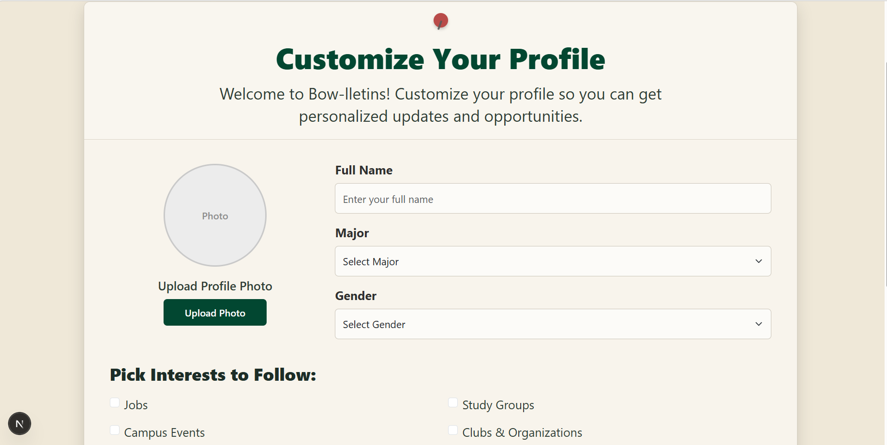

## 🚀 Live App
👉 [Visit Bow-lletins](https://bowlletins.vercel.app/)

---

## 👥 Team
- [Tamela Brinson](https://tamelab.github.io/)  
- [Annie Pham](https://anniep211.github.io/)  
- [Terisa Lau](https://terisa-lau.github.io/)  
- [Thomas Tran](https://thomastran808.github.io/)  
- [Caden Tran](https://cadentran44.github.io/)  

---

## 📂 Project Links
- [GitHub Repository](https://github.com/bowlletins)
- [Vercel](https://bowlletins.vercel.app/)

---

## 📄 Team Contract
👉 [View Contract](https://docs.google.com/document/d/12syu77LU1G1QKkW4B-k4xmobbV0jm0g-6yr_FPQ26Ls/edit?usp=sharing)

---

## 🧠 Project Overview
Students at UH Mānoa often miss opportunities because information is scattered across bulletin boards, emails, and social media. Bow-lletins solves this by providing a single, organized, and searchable platform for campus information.

---

## 🖼️ Screenshots
Landing Page- This will be the first page a user sees, we chose the color scheme to reflect our beautiful school colors. 

Signup Page- This is were you would navigate to signup for bowllettins.

Customize Profile Page - This option becomes available tothe user after sign uo has been initiated.

---

## 📌 Project Boards
- [M1 Project Board](https://github.com/orgs/bowlletins/projects/5/views/2)  
- [M2 Project Board]:(https://github.com/orgs/bowlletins/projects/6) 

---

## ⚙️ Deployment
[Bow-lletins Website](https://bowlletins.vercel.app/)
