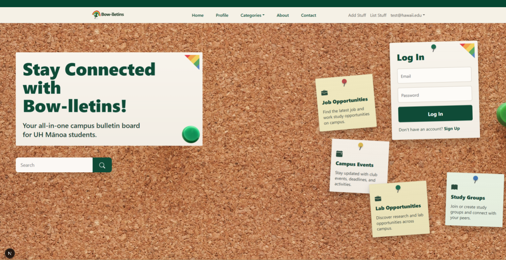
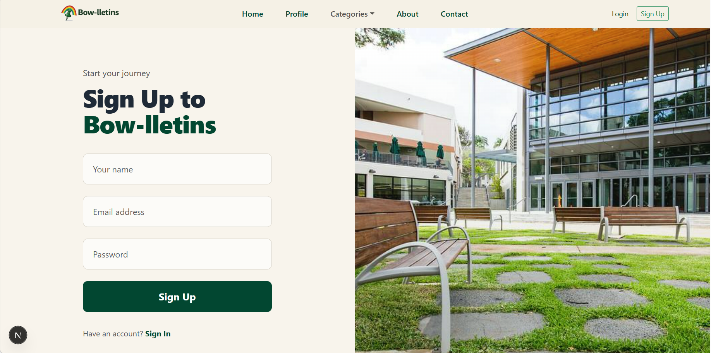
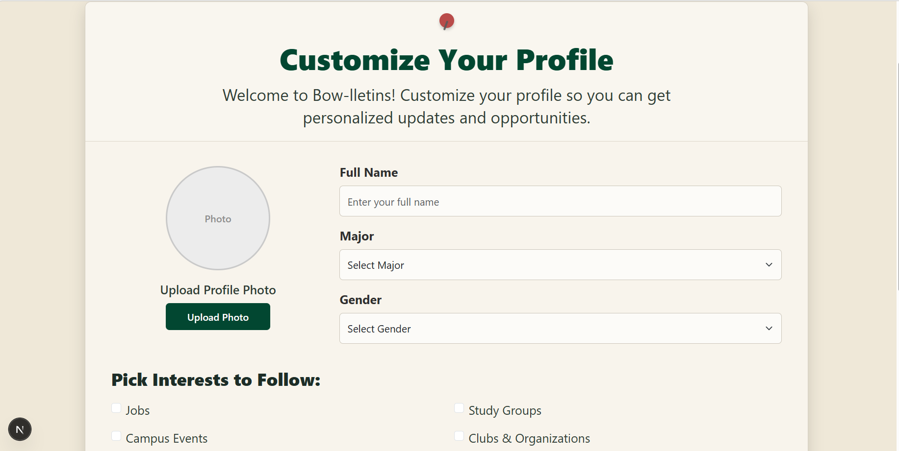
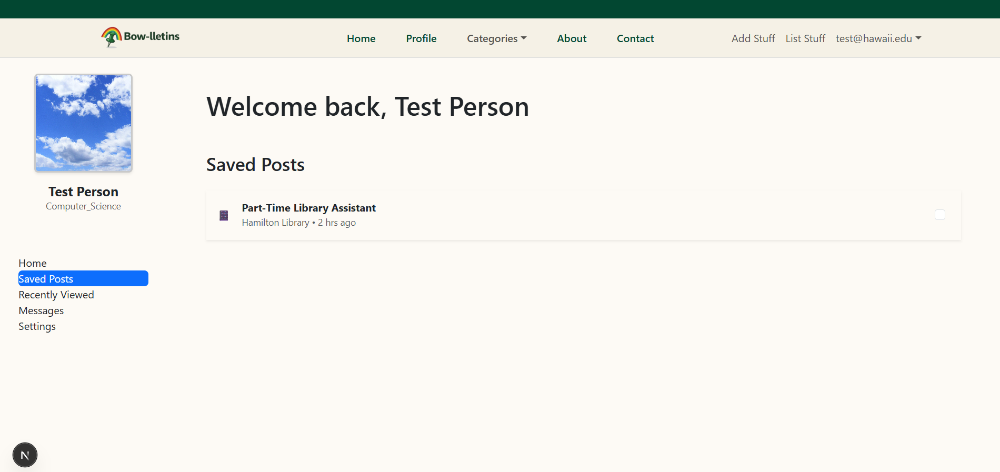
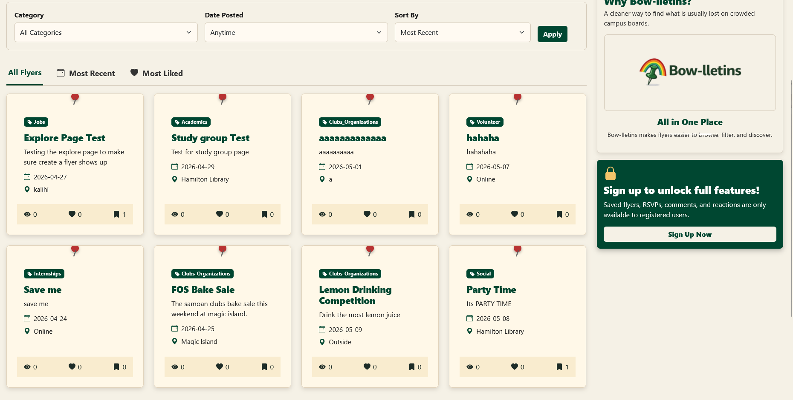
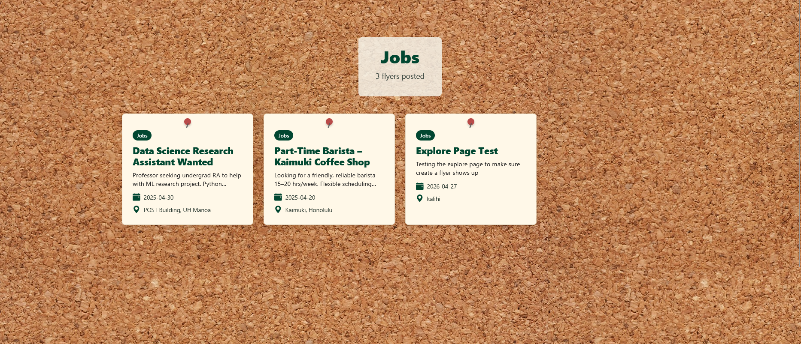
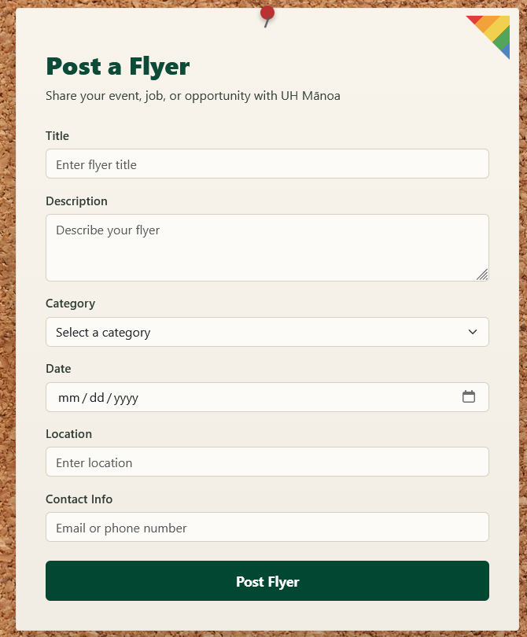
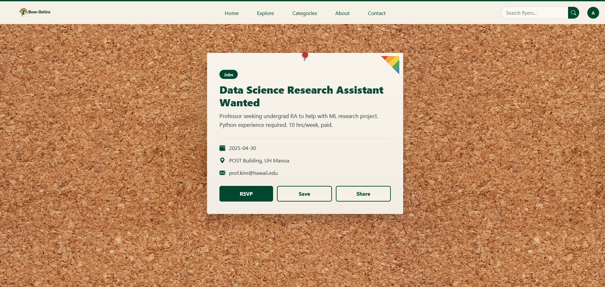

<h2>🧠 Project Overview</h2>

Students at UH Mānoa often miss opportunities because information is scattered across bulletin boards, emails, and social media. Bow-lletins solves this by providing a single, organized, and searchable platform for campus information.

<h2>⚙️ Deployment</h2>

<a href="https://bowlletins.vercel.app/">Bow-lletins Website</a>

<h2>👥 Introducing the Team!</h2>

<a href="https://tamelab.github.io/">Tamela Brinson</a> 
<a href="https://anniep211.github.io/">Annie Pham</a> 
<a href="https://terisa-lau.github.io/">Terisa Lau</a> 
<a href="https://thomastran808.github.io/">Thomas Tran</a> 
<a href="https://cadentran44.github.io/">Caden Tran</a>

<h2 style="border-bottom: none;">📄 Team Contract</h2>
<a href="https://docs.google.com/document/d/12syu77LU1G1QKkW4B-k4xmobbV0jm0g-6yr_FPQ26Ls/edit?usp=sharing">View Contract</a>

<h2>📂 Project Links</h2>

<a href="https://github.com/bowlletins">GitHub Organization</a> 
<a href="https://github.com/bowlletins/Bowlletins">GitHub Repository</a>

<h2>🖼️ Stay Up to Date with Bow-lletins</h2>

<h3>Landing Page</h3>

This is the first page a user sees. We chose the color scheme to reflect our school colors.

<h3>Signup Page</h3>

This is where users would navigate to sign up for Bow-lletins.

<h3>Customize Profile Page</h3>

This option becomes available after sign-up has been started.

<h3>Explore Page</h3>

Users can browse all posted flyers in one place, with search and filtering options.

<h3>Categories Page</h3>

Flyers are organized by category — jobs, events, study groups, internships, and more.

<h3>Create Flyer Page</h3>

Signed-in users can post a new flyer by filling out the form with title, description, date, location, and category.

<h3>Flyer Detail Page</h3>

Users can view full details of a flyer including title, description, date, location, and contact information. Users can also RSVP, Save, or Share the flyer.

## User Guide

### Getting Started

1. Visit the deployed site:
   https://bowlletins.vercel.app

2. Browse flyers directly without logging in.

### Browsing Flyers

- Flyers are displayed as sticky notes on a corkboard background.
- Each flyer includes:
  - Title
  - Description
  - Date
  - Location
  - Category

Click a flyer to view more details.

### Searching

- The search bar is located in the navigation bar.
- On mobile, it appears inside the dropdown menu.

You can search by:
- Title
- Description
- Category
- Location

### Categories

Users can filter flyers by category:
- Jobs
- Internships
- Study Groups
- Events
- Clubs

Each category opens a filtered page.

### User Permissions

#### Without Logging In
- Browse flyers
- Search content
- View details

#### Logged-In Users
- Save flyers
- React (like, save)
- Comment
- RSVP (if enabled)

<h2>📌 Project Boards</h2>

<a href="https://github.com/orgs/bowlletins/projects/5/views/2">M1 Project Board</a> 
<a href="https://github.com/orgs/bowlletins/projects/6">M2 Project Board</a> 
<a href="https://github.com/orgs/bowlletins/projects/8/views/1">M3 Project Board</a> 

